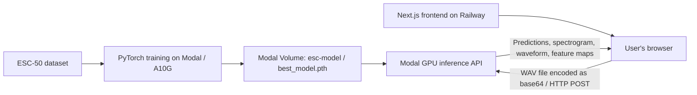
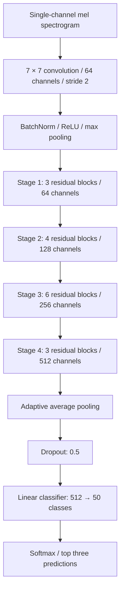

# Audio Classifier & CNN Visualizer

An environmental sound classifier that lets you explore what a convolutional neural network sees in audio. Upload a WAV recording to get the three most likely sound classes, view its waveform and mel spectrogram, and inspect feature maps from the model's convolutional stages and residual blocks.

The model is trained with PyTorch on **Modal's NVIDIA A10G GPUs** using the **ESC-50 dataset**. Modal also hosts the inference API. A **Next.js frontend deployed on Railway** provides the upload interface and renders the results.

**[Try the live demo](https://audioclassifier-production-cefe.up.railway.app)**

## Features

- Classifies environmental sounds across 50 categories, including animals, weather, human sounds, household noises, and machinery.
- Shows the top three predictions with softmax confidence scores.
- Visualizes the uploaded recording as a waveform and mel spectrogram.
- Displays feature maps from the initial convolution, four residual stages, and individual residual blocks.
- Separates GPU training and inference from the web frontend.

## System architecture



| Component | Responsibility | Location |
| --- | --- | --- |
| Training job | Downloads ESC-50, trains the CNN, evaluates each epoch, saves the best checkpoint | Modal app `audio-cnn` |
| Model storage | Stores model weights, class labels, and TensorBoard logs | Modal Volume `esc-model`, mounted at `/models` |
| Inference API | Loads the checkpoint, processes audio, runs the model, returns predictions and visualization data | Modal app `audio-cnn-inference` |
| Frontend | Provides WAV upload and renders results with React and SVG | Railway |

The browser sends audio directly to Modal. Railway serves the frontend; it does not run the model or relay inference requests.

## Model architecture

`model.py` implements a residual CNN with a ResNet-34-style block layout, adapted for single-channel spectrograms. The training code initializes the model from scratch; it does not load pretrained image weights.



Each residual block contains two 3 × 3 convolutions with batch normalization, a skip connection, and ReLU activations. Blocks that change spatial resolution or channel count use a 1 × 1 convolution in the skip path. The first blocks in stages 2–4 downsample with stride 2.

During inference, the model also returns intermediate activations. The API averages these across channels to create 2D feature maps. These show activation patterns, rather than class-specific explanations such as Grad-CAM.

## Where and how the model is trained

Training runs remotely on **Modal**, not on Railway or in the browser. `train.py` defines a GPU function using an NVIDIA A10G with a three-hour timeout. Its container installs the Python and system dependencies and downloads ESC-50 into `/opt/esc50-data`.

### Dataset

[ESC-50](https://github.com/karolpiczak/ESC-50) contains 2,000 five-second environmental recordings across 50 classes, with 40 examples per class. The dataset provides five predefined folds.

This project uses folds **1–4 for training** and fold **5 for validation**: 1,600 training recordings and 400 validation recordings. It uses a single held-out fold rather than running full five-fold cross-validation. Class labels are sorted alphabetically and saved with the model checkpoint.

### Audio representation and augmentation

Audio is converted to mono and represented as a mel spectrogram, then converted to decibels.

| Setting | Value |
| --- | --- |
| Mel bins | 128 |
| FFT size | 1,024 |
| Hop length | 512 |
| Mel transform's configured sample rate | 22,050 Hz |
| Frequency range | 0–11,025 Hz |
| Training frequency mask | Parameter 30 |
| Training time mask | Parameter 80 |
| Mixup | Applied with approximately 30% probability; Beta(0.2, 0.2) mixing coefficient |

Validation uses the mel and decibel transforms without masking or mixup. See [Current limitations](#current-limitations) for the sample-rate inconsistency in the current implementation.

### Training configuration

| Setting | Value |
| --- | --- |
| Epochs | 100 |
| Batch size | 32 |
| Optimizer | AdamW |
| Initial learning rate | 0.0005 |
| Weight decay | 0.01 |
| Learning-rate scheduler | OneCycleLR, maximum learning rate 0.002 |
| Loss | Cross-entropy with label smoothing of 0.1 |
| Checkpoint selection | Highest validation accuracy |

When validation accuracy improves, the job saves `/models/best_model.pth` to the `esc-model` Volume. The checkpoint contains the model state, class names, validation accuracy, and epoch. TensorBoard logs are written to `/models/tensorboard_logs/run_<timestamp>`.

The repository does not include a checkpoint or training results, so no final validation accuracy is claimed here. A prediction's confidence is not the model's overall accuracy.

## Inference flow

1. The user selects a WAV file in the frontend.
2. The browser reads the file, base64-encodes its bytes, and sends a JSON `POST` request to Modal.
3. The API decodes the audio, converts stereo to mono, and resamples it to 44,100 Hz when necessary.
4. The audio is transformed into a mel spectrogram and passed through the CNN on the GPU.
5. The API applies softmax, selects the top three classes, and collects intermediate feature maps.
6. The browser renders predictions, the input spectrogram, a reduced waveform, and feature-map heatmaps.

The inference container loads `/models/best_model.pth` when it starts and uses evaluation mode with gradients disabled. It is configured with a 15-second scale-down window, so requests after an idle period may experience a cold start.

### API contract

The frontend uses `NEXT_PUBLIC_INFERENCE_URL` as the endpoint.

```json
{
  "audio_data": "<base64-encoded WAV file>"
}
```

The response includes:

| Field | Contents |
| --- | --- |
| `predictions` | Three objects containing `class` and `confidence` |
| `visualization` | Layer names mapped to feature-map `shape` and 2D `values` |
| `input_spectrogram` | Spectrogram `shape` and 2D `values` |
| `waveform` | Sample `values`, `sample_rate`, and `duration` |

## Technology stack

- **Model and training:** Python, PyTorch, torchaudio, NumPy, pandas, TensorBoard.
- **Inference:** Modal GPU containers, FastAPI endpoint, Pydantic, librosa, SoundFile.
- **Frontend:** Next.js 15, React 19, TypeScript, Tailwind CSS 4, shadcn UI components, SVG visualizations.
- **Hosting:** Modal for training and inference; Railway for the frontend.

## Repository structure

```text
.
├── train.py                   # ESC-50 loading, augmentation, training, validation
├── model.py                   # ResidualBlock and AudioCNN definitions
├── main.py                    # Modal inference endpoint and sample client
├── requirements.txt           # Python container dependencies
├── fireworks.wav              # Sample audio for inference
└── audioclassifier/
    ├── src/app/page.tsx        # Upload, API requests, and results interface
    ├── src/components/        # Waveform, feature maps, and UI components
    ├── src/env.js             # Environment variable validation
    ├── src/styles/            # Frontend styles
    ├── .env.example           # Public inference endpoint configuration
    └── package.json           # Frontend dependencies and scripts
```

## Run the frontend locally

Use Node.js and npm. From the repository root:

```sh
cd audioclassifier
npm ci
cp .env.example .env
npm run dev
```

Open `http://localhost:3000` and upload a WAV file. The existing Modal endpoint can be used without running training locally.

Set the endpoint in `.env`:

```dotenv
NEXT_PUBLIC_INFERENCE_URL=https://arvidon--audio-cnn-inference-audioclassifier-inference.modal.run
```

To verify and run a production build:

```sh
npm run build
npm run start
```

## Train and deploy on your own Modal account

Use Python 3.12 or newer for the syntax in `main.py`, and authenticate with your Modal account:

```sh
python -m venv .venv
source .venv/bin/activate
pip install modal requests
pip install -r requirements.txt
modal setup
```

Run training from the repository root:

```sh
modal run train.py
```

The local entrypoint launches `train.remote()`, so training takes place on Modal's GPU infrastructure. Training creates the `esc-model` Volume and writes the best checkpoint there. GPU usage incurs Modal charges according to your account's plan.

After a checkpoint is available in the same Modal environment, deploy the inference API:

```sh
modal deploy main.py
```

Use the endpoint generated for your account as `NEXT_PUBLIC_INFERENCE_URL`, then rebuild the frontend. Modal's [CLI documentation](https://modal.com/docs/cli/latest) explains the run and deployment commands.

## Deploy the frontend on Railway

Connect this repository to a Railway service and configure:

| Setting | Value |
| --- | --- |
| Root directory | `/audioclassifier` |
| Builder | Railpack |
| Build command | `npm run build` |
| Start command | `npm run start -- --hostname 0.0.0.0` |
| Health check path | `/` |
| Environment variable | `NEXT_PUBLIC_INFERENCE_URL=<your Modal endpoint>` |

Next.js uses Railway's injected `PORT`. Generate a Railway domain or connect a domain you own. Keep the service root set to `/audioclassifier` so Railway builds the frontend rather than detecting the Python backend at the repository root.

`NEXT_PUBLIC_INFERENCE_URL` is embedded in the browser bundle at build time. Changing it requires rebuilding the frontend. It is a public URL; do not put API secrets or Modal credentials in `NEXT_PUBLIC_` variables.

## Current limitations

- **Sample-rate handling:** The mel transform is configured for 22,050 Hz, but training does not explicitly resample loaded recordings, and inference resamples to 44,100 Hz. These settings should be made consistent before retraining or interpreting frequency axes.
- **Fixed class set:** The model predicts among the 50 ESC-50 classes. It has no explicit unknown-sound class and may assign a high score to an unfamiliar sound.
- **Evaluation scope:** Fold 5 is used for checkpoint selection. Its best validation accuracy is not an independent test result or a five-fold benchmark score.
- **Visualization size:** Feature maps are returned as JSON and rendered as SVG rectangles. Long recordings can produce large responses and slow rendering; short clips close to the training dataset's five-second duration are a sensible starting point.

## Dataset attribution

This project uses [ESC-50 by Karol J. Piczak](https://github.com/karolpiczak/ESC-50). Consult the dataset's [license](https://github.com/karolpiczak/ESC-50#license) and citation instructions before redistributing recordings or using them in another project.
